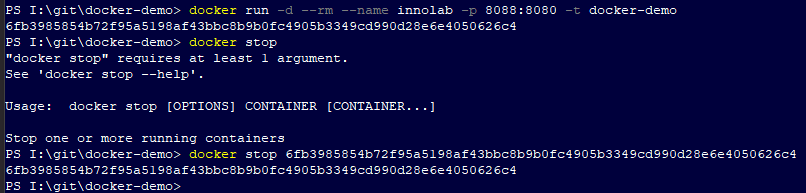

# Making any Spring Boot app run in a Docker container

In the following example, I will use a (ridiculously) basic Spring Boot app. The app is a simple REST web app that outputs the following plain test "Hello Docker World!".
The app is running on Tomcat on port 8080 and is packaged as a jar file. The project was named "docker-demo" and the jar file is named "docker-demo".

## Prerequisites (My set-up is on Windows)
* Docker Desktop
* Java 17 or higher
* An existing Spring Boot app

## Build the Docker image
    
```shell
    docker build --platform linux/amd64 -t docker-demo .
```

## Run the container

```shell
docker run -d --rm --name innolab -p 8088:8080 -t docker-demo
```
### This Run Command Explained
__-d__ (aka --detach) Runs container in background and prints container ID. The container needs to be stopped with the Docker Desktop or the __docker stop [CONTAINER ID]__ command.

__--rm__ Automatically remove the container when it exits [optional]\
__--name__ Assign a name to the container [optional]\
__-p__ Publish a container's port(s) to the host. In this case, browsing to port 8088 will redirect to tomcat exposed 8080.\
__-t__ Help page says: "*Allocate a pseudo-TTY*". Not actually correct. This indicates the name of the image to run. [REQUIRED]